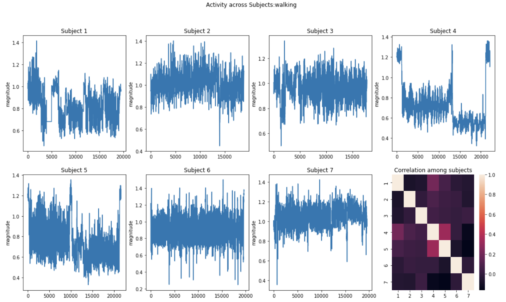
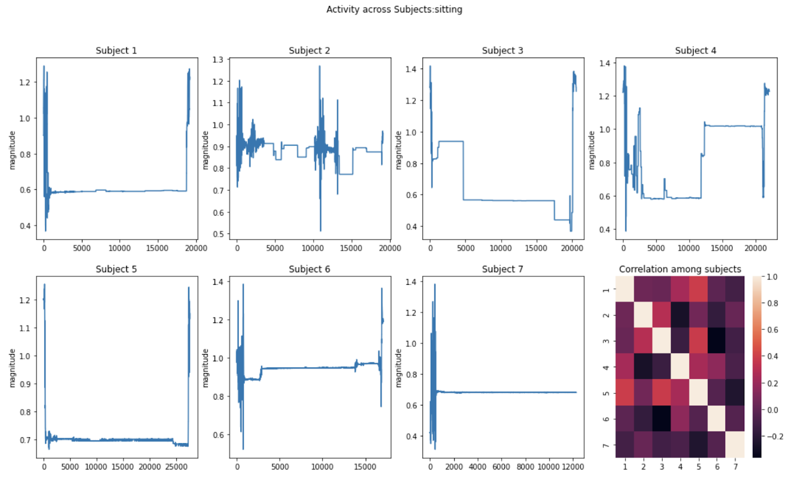
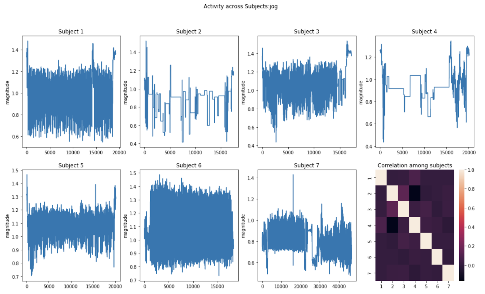

We performed an initial exploration from the data collected, the dataset had the accelerometer x,y and z axis data from which we computed the magnitude of the raw accelerometer signals and performed this exploratory analysis.

First, let’s look at the magnitude of some of the activities across the subjects. We consider three activities randomly selected at two different sensor placements, we plot the magnitude as well as correlation between the magnitude of accelerometer signals across subjects.

### Sensor placement 1 : Phone in hand

The plots below show walking activity, for the 7 subjects. We can see that activity like walking varies based on how each individual subject walks, either fast or slow. In addition to this it also varies with which hand or the position in which they held their phone while recording the data. There is very little correlation between the signals as shown in the heat map, which indicates that the walking pattern of each individual can different.

Next we plot the sleeping and sitting position activity, here we can see a minor pattern emerging this can be due to the fact that not much movement is observed while recording while sitting and operating the phone. This also implies that sitting and sleeping could be generalized easily compared to other activities. The correlation plot also reflects this, with high correlation across subjects for sitting and sleeping activities.

### Sensor placement 2 : Phone in pocket 

Similar to the previous exploration, we plot the magnitude for the mobile phone placed in the subject’s pocket. We find similar observations, for sitting and sleeping activity there is a correlation between the subjects indicating that sensor placement does not matter here because there is not much movement from the subject’s. However when we look at the jogging activity we find not much correlation in the signals across subjects.

**The below plot shows the activity recorded for a single subject (7th).** 

