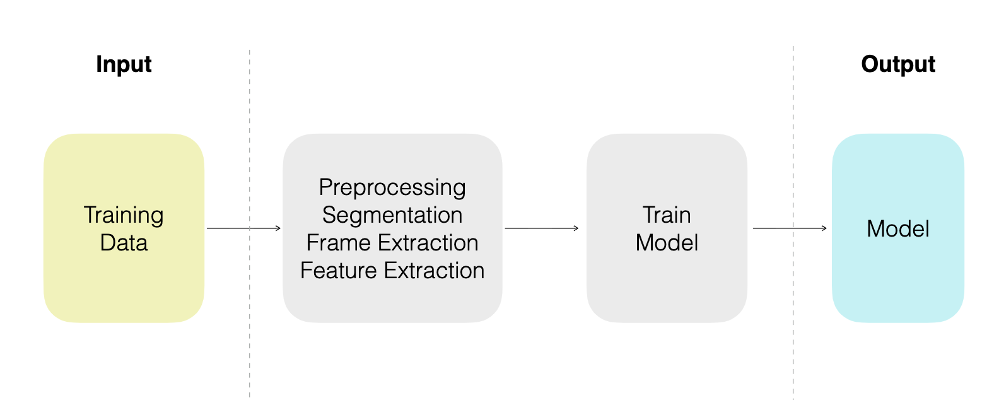
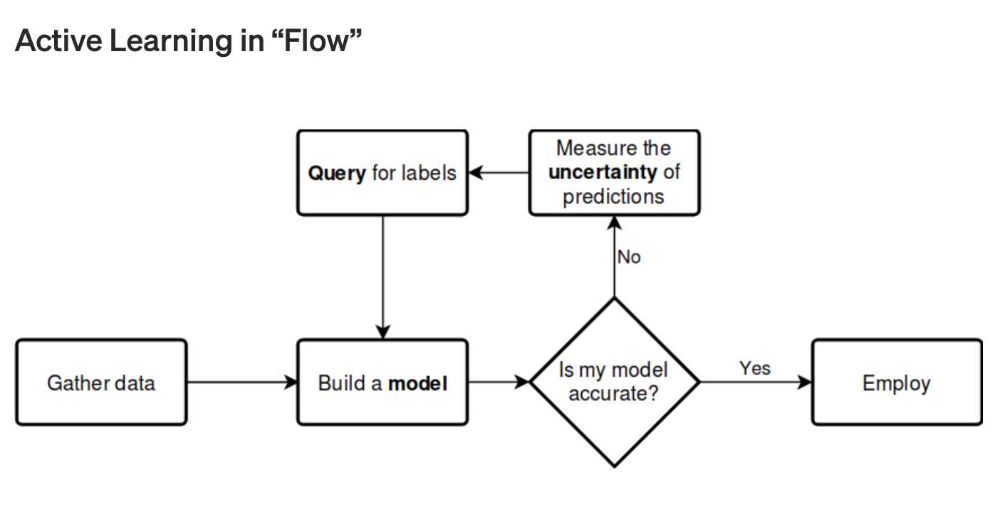

As we know, the pipeline for activity recognition is as shown below, and we have discussed the dataset collection in the previous section.

We move on to the next step which is frame,feature extraction.  We perform basic preprocessing to drop samples in the start and end of the data for each activity for all subjects. The frames are extracted for a window of 100ms with 50ms overlapping frames. Since our goal is to study personalization, we did not experiment on different frame sizes. The data is recorded at 100Hz hence we selected 100ms frames with 50% overlap.

We have used time-domain features that have worked well in previous work designed for accelerometer data. We believe that since the accelerometer signals are captured in time domain, these features are sufficient to model the activities. 

We extracted the following features for each frame, mean, variance, standard deviation, median, third and fourth moment, 25,50 and 75 percentile, skewness, kurtosis and rms of signal. We obtain the above features for the raw accelerometer signals along X,Y and Z axis as well as the magnitude signal. Finally we obtain a total of 48 features. The choice of these features are based upon previous works as well as assignments in class. 

| Features Extracted        |      Number of Features      |
| ------------------------- | :--------------------------: |
| Mean                      |   4 (AccX,AccY,AccZ,MagAcc)  |
| Median                    |   4   |
| Variance                  |   4    |
| Standard Deviation        |   4   |
| Third Moment              |   4   |
| Fourth Moment             |   4   |
| 25th Percentile           |   4   |
| 50th Percentile           |   4   |
| 75th Percentile           |   4   |
| Skewness                  |   4   |
| Kurtosis                  |   4   |
| RMS                       |   4   |
| **Total**                     |              48              |

Once we obtain the features, we train our baseline models. We use a RandomForestClassifier as the machine learning model. The choice of RandomForestClassifier is from prior literature review as well as widespread use of ensembling methods. Ensemble methods help to achieve the bias-variance tradeoff. When the number of estimators increases the variance can be reduced, by averaging out across the different weak learners. In addition to this random forest identifies different subsets of features to train the different base learners thereby preventing overfitting.

### Active learning 

We identify the most informative samples or the samples where the model is uncertain on it’s prediction and use a pool-based strategy to query for these. The setup for this is, there is a set of labeled instances, a set of unlabeled instances, and a golden oracle which provides the label for an unlabeled instance when queried. During each iteration we find the instance which we want the oracle to label using different query strategies and then add them to the labeled pool to retrain the model and evaluate them. In this way the model starts to slowly learn from the additional samples provided.

The main query strategies which we analyzed are based on Uncertainty sampling. The usefulness of a instance is calculated based on different measures like classification uncertainty, classification margin and classification entropy. We briefly explain the measures below, 

### Ensembling with entropy 

In this method, we use two models (RandomForest and MLPClassifier) to train a classifier and then evaluate the predictions of both the classifiers on the unlabeled instance.  Then we measure the entropy in the probability distribution of the predictions from the two models. This shows if the unlabeled instance has a different probability distribution from one model to another which indicates uncertainty.

### Least confidence

This is one of the simplest methods to measure the uncertainty. We do this by measuring the prediction probability from the model, and select the samples whose confident predictions are less than 0.5 as uncertain. This implies that the model is able to predict the class only with 0.5 probability making it uncertain.

### Minimum margin 

The most intuitive form of uncertainty sampling is the difference between the two most confident predictions. We measure this by identifying for the label that the model predicted, how confident is this prediction than the next most confident label prediction by the model. In other words it measures the difference in confidence between the first and second most likely predictions. 

### Random sampling

For random sampling, we sample randomly selected samples from the unlabeled pool without any criterion and add it to the labeled set.

