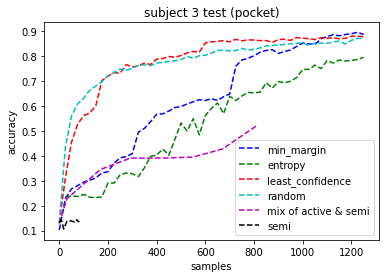
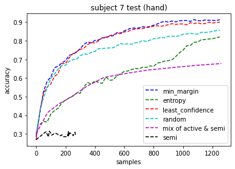
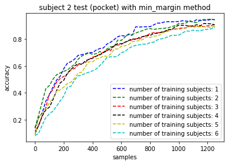
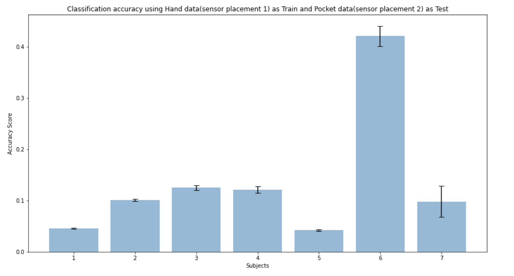
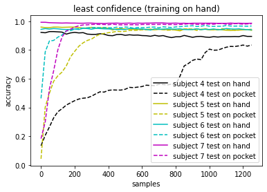

## Experiment 1
### Goal
Identify the improvement in performance over time for a single subject not present in the training dataset using active and semi-supervised learning methods.

### Baseline
Obtain the baseline model for hand and pocket data using LOSO and hold out validation separately. The classifier we decide to use is RandomForest.
- We train a model with hand data only and evaluate using Leave One Subject Out Validation. 
- In order to justify the poor performance of LOSO, we also evaluate using hold out validation(subject dependent). i.e. we train only on Subject 1 and test on Subject 1 data using a 80:20 split of the dataset.
- We perform the same set of experiments using pocket data.
- Each of the models are trained 5 times to account for variance in evaluation, we have plotted the error bars to show the variance in the accuracy score across 5 different runs of the model.
- The results are as shown below:
 

Unsurprisingly, the performance of hold-out is much better than that of LOSO as basically each individual activities are uncorrelated. It is hard to predict one subject's activities correctly using other subject's data.

### Experimental Setup
To reiterate we have obtained our baseline using LOSO as discussed above, next we move on to active learning.

In active learning, we expand our training data set using different query methods. That means we convert some unlabeled instances to labeled instances and add them to the training set by various criterions. After that, we retrain the model and retest to get the updated accuracy results. It simulates continually learning from the activities of the individual subject over time. 

Regarding the experimental parameters, we specify the number of rounds is 50, and the batch size for each round is 25. In each round, we perform active learning with various criterions to select 25 instances from unlabeled data pool.

#### Training Set
- *Baseline*: Data from all of the subjects except subject i to build a baseline model, where the subject i is the test subject.
- *Personalization*: Part of the unlabeled data from subject i would be added to traning set at each round.

#### Test Set
A subset of the data from the subject i using a 67:33 split of the dataset, which is the golden test data that never be put into the traning data set.

### Results
First, the total number of instances after feature extraction for each subject is listed below:

| Category    |      Subject      |   Total number of instances  | Number of Golden Test instances | Number of unlabeled instances in the pool|
| ------------| :---------------: | :-------------------------:  | :-------------------------:     | :-------------------------:              |
| hand        |   1               |   3769                       |		1243					   |    2526								  |
| hand        |   2               |   3311                       |		1092				       |	2219                                  |
| hand        |   3               |   3637                       |		1200					   |    2437                                  |
| hand        |   4               |   4015						 |		1324					   |    2691                                  |
| hand        |   5               |   4376						 |		1444					   |    2932                                  |
| hand        |   6               |   3983						 |		1314					   |    2669                                  |
| hand        |   7               |   4007						 |      1322                       |    2685                                  |
| pocket      |   1               |   2991						 |       987                       |    2004                                  |
| pocket      |   2               |   2785						 |       919                       |    1866                                  |
| pocket      |   3               |   2991						 |       987                       |    2004                                  |
| pocket      |   4               |   3215						 |      1060                       |    2155                                  |
| pocket      |   5               |   3486						 |      1150                       |    2336                                  |
| pocket      |   6               |   3352						 |      1106                       |    2246                                  |
| pocket      |   7               |   3590						 |      1184                       |    2406                                  |

It is as expected that the accuracy increases as more labeled instances are added to the training set. In the comparison of different query methods, our experimental results show that the active learning with least confidence has the best performance, achieving 70%-80% accuracy when 20% of all original unlabeled data are added (500 out of 2500 samples) while the semi-supervised learning has the worst performance. Furthermore, semi-supervised learning is not able to get enough new samples to retrain the model if we select only the samples with high confidence. Therefore, we use the combination of active learning and semi-supervised learning instead. But it still gets worse performance compared to other methods. The reason could be that the baseline classifier has a bad detection rate, and it causes too many wrongly labeled data added to the training data set. Besides, one thing worth being aware of is that we can get a good result even if we just randomly query the unlabeled data.

 

 

On the other hand, we also compared the performance of different sensor placements under a specific query method for each subject. The result shows that for each subject, we can get better performance with training and testing a model on pocket than on hand. This is reasonable since putting smartphone in pocket limits more to some extent the degree of freedom of the movement of a smartphone on pocket than on hand. Therefore, we can get a more similar pattern for different subjects on the pocket, and it becomes easier to personalize the model.

 

 

Furthermore, We also study the impact of the number of training subjects on the performance: As expected, the performance became worse with more training subjects used to build the original model. That means it is more difficult to adapt to the model when more other people’s data is considered in the training model.

 

 

## Experiment 2
### Goal
Identify how much can a classifier be adapted to account for sensor placement variations for a single individual subject

### Baseline
We obtain baseline model for training on hand data of each subject separately and testing on pocket data of that corresponding subject with a RandomForest classifer. This becomes the baseline for Experiment 2 where we try to build a robust classifier to account for sensor placement variations for individual subjects. We can see that the performance of the classifier is very low as shown in the plot, which is expected because when we train a model to recognize activity by recording data with mobile phone on hand from a single subject and then test it on data recorded with mobile phone in pocket, the accuracy is bound to be low.

### Experimental Setup
We keep expanding the training set and retrain the model by adding more pocket data using active learning and semi-supervised learning, and observe the variation on both pocket/hand test data sets.
Regarding the experimental parameters, we specify the number of rounds is 50, and the batch size for each round is 25. In each round, we perform active learning with various criterions to select 25 instances from unlabeled data pool.

#### Training Set
- *Baseline*: hand data of a specific subject i 
- *Personalization*: pocket data of a specific subject i

#### Test Set
A subset of hand data and pocket data of a specific subject i

### Results
We can observe that the performance of placement on hand remains stably high as more unlabeled data is converted to labeled data and added to the training set. On the other hand, we can also observe that the performance of a personalized classifier would increase exponentially at first, and then reach an upper bound close to the other placement when a certain number of training data are newly added. It indicates that we can adapt a classifier with active learning to get a good performance of activity recognition even if the placement changes.

 

 
